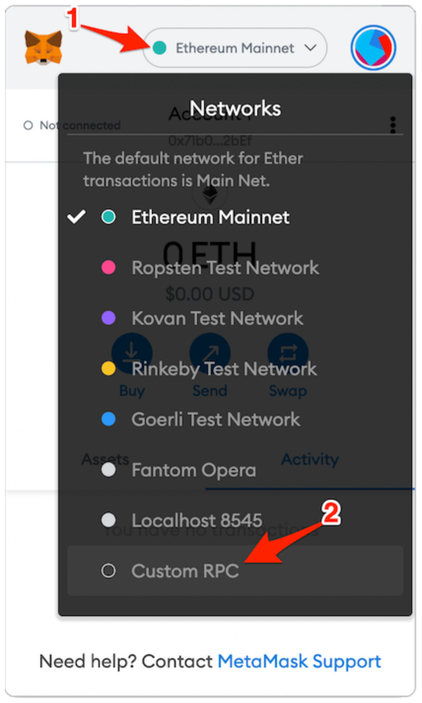
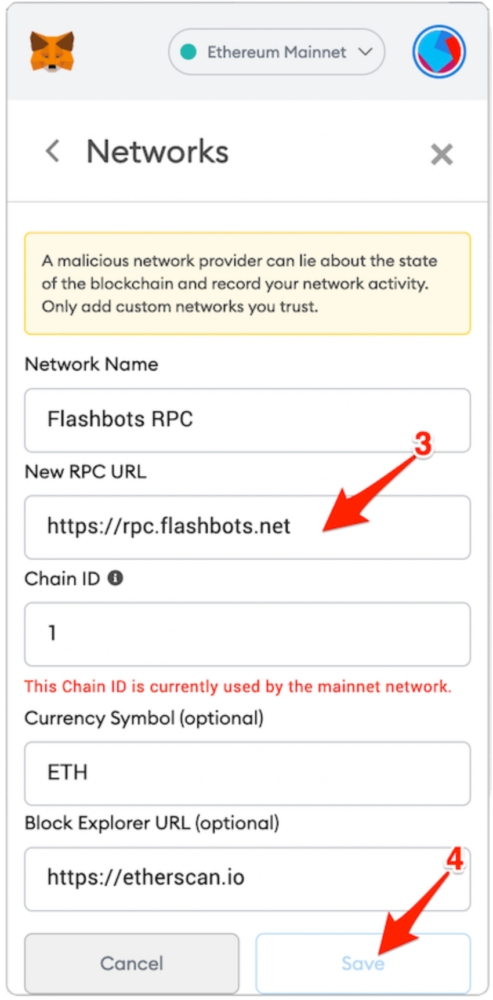

# FB代币抢购工具设计与规划

## APE抢购事件回顾

[成交交易的Etherscan链接](https://etherscan.io/tx/0xb0474af1d11031a272bf6e4f1f793421d059bb7f8029018bac0d300238c9ac71)

这次抢购时按照如下操作流程进行的

### 1. 设置好小狐狸的 FB RPC 

与设置BSC网络方法一致，FB的RPC地址：<https://rpc.flashbots.net>

流程图如下：

--- 

### 2. 小狐狸选择FB网络

记得将Metamask默认的Infura节点切换到刚刚设置好的FB节点。

### 3. 当Uniswap上价格合适时，进行购买

昨天这里是通过Uniswap前端做的，后续工具可以给用户一个通道用来设置心理价位，构造好Uniswap参数，直接与合约进行交互。

### 4. Gas价格给出高于当前平均值

由于FB交易被打包的概率相对较小，所以提高了gas，为了增加交易打包概率。

### 5. 多次在同一个nonce值上发送购买交易

FB交易对于失败交易缓存时间有限，所以需要定时的发送交易包给FB节点，这样可以保证交易在可以执行成功时被打包。

### 6. 等待成交

这次大概等了5、6分钟才交易才confirm。

## 使用FB进行抢购的优势与劣势

### 优势

* FB默认不会打包失败交易，这样就消除了抢购失败的gas消耗。
* FB会将FB交易放在区块头部，有一定概率可以防止被机器人夹(但是这笔交易还是被抢跑了，😔)
* FB会将交易缓存一段时间，即使当前交易失败，也会在未来一段时间进行尝试

### 劣势

* FB并不是百分百出块，虽然没有失败交易的gas消耗，但是交易被打包的几率也小了一些；
* 节点并不会优先打包FB交易，而是根据利益最大化，选择性的选择交易打包，所以FB交易消耗的Gas会相对较高；
* FB中也有可能被夹

## 由此事件延展出的产品模型

要实现的目标：

* 在池子波动比较大的情况下，抢购低价代币(一般在刚开池子的时候)。
* 控制成本，给出几个档次给用户选择；成本越高，交易打包概率越大，在用户的选择下最大化交易被打包概率。
* 尽可能地防止交易被🤖️抢跑套利。
* 可以看到FB交易状态，使得用户使用较友好。

## 产品技术组成模块

要实现此工具，需要做到下面👇几点：

1. 熟悉Uniswap V2和V3的合约，能够做到构建正确的参数发起交易(V3还未掌握)。
2. 能够使用FB发起交易，并且控制交易的优先级(控制交易优先级还需要研究)。
3. 能够查看FB交易当前的状态，作为判断是否重新发起交易的依据，其次给用户及时的反馈(OK✅)。
4. 能够从pending交易池中预测未来的平均 gas price(OK✅)。